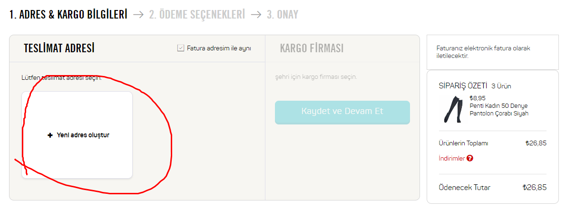

A101 Selenium test otomasyon projesidir. A101 ürün arama, seçme,satın alma,favorilere ekleme, ekleyip çıkarma işlemleridir.

- https://www.a101.com.tr/ sitesine gelecek ve anasayfanin acildigini onaylayacak
- Senaryoya üye kaydı oluşturmadan devam edilecek.
- Giyim--> Aksesuar--> Kadın İç Giyim-->Dizaltı Çorap bölümüne girilir.
- Açılan ürünün siyah olduğu doğrulanır.
- Sepete ekle butonuna tıklanır.
- Sepeti Görüntüle butonuna tıklanır.
- Sepeti Onayla butonuna tıklanır.
- Üye olmadan devam et butonuna tıklanır.
- Mail ekranı gelir.
- Sonrasında adres ekranı gelir. Adres oluştur dedikten sonra ödeme ekranı gelir.
- Siparişi tamamla butonuna tıklayarak, ödeme ekranına gidildiği ,doğru ekrana yönlendiklerini kontrol edecekler.
  
Hangi Teknolojiler Kullanıldı

- Bu proje için java ve intellij kullanıldı.
- Selenium Test Aracı olarak kullanıldı.

