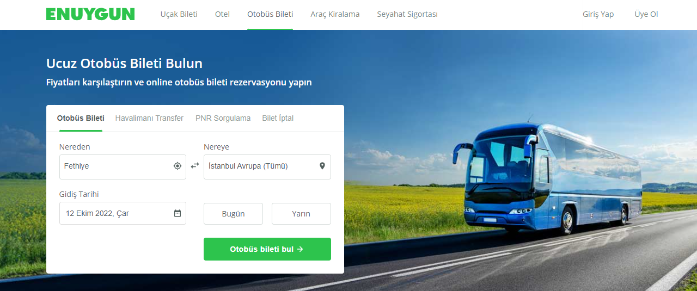
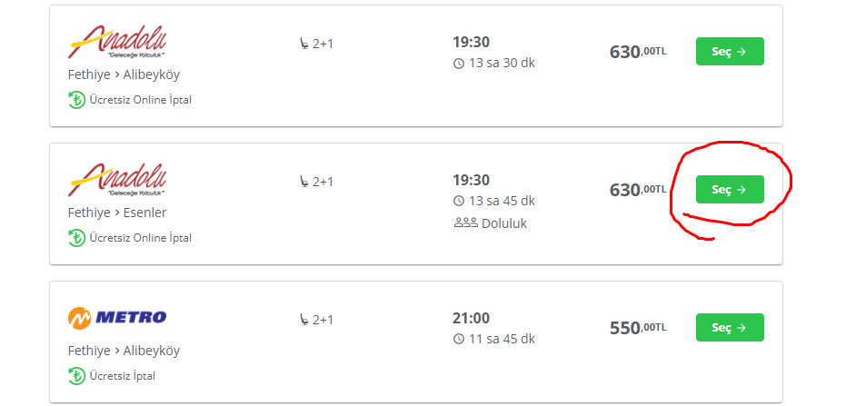
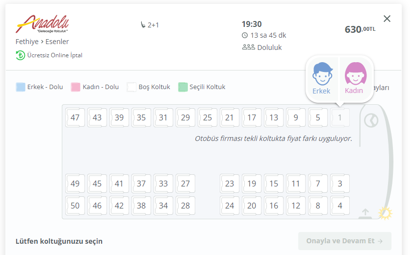
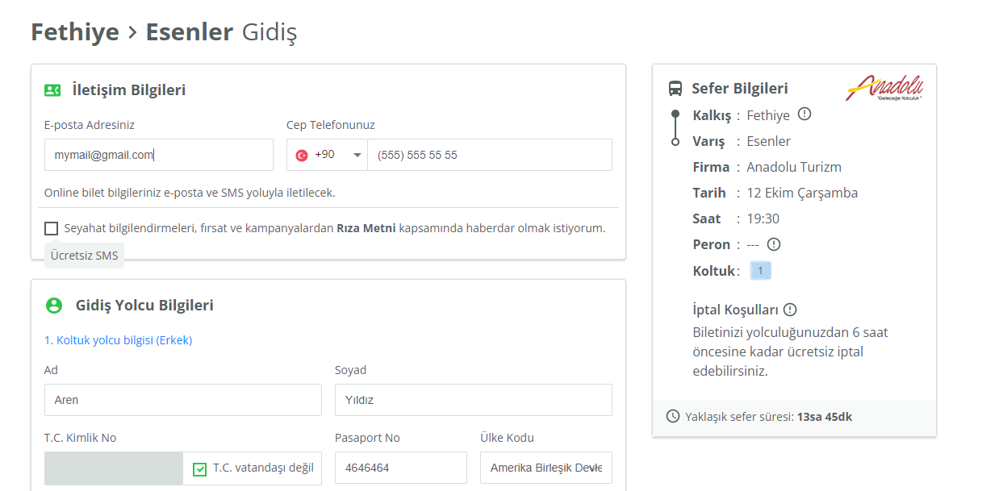
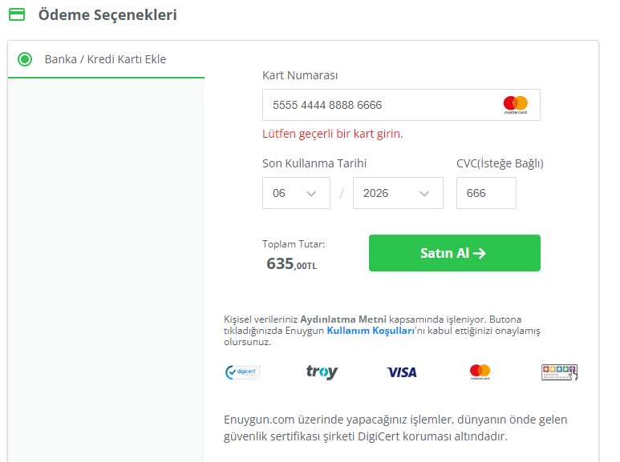

EnUygun Selenium test otomasyon projesidir. EnUygun Uçak,Otobüs bileti arama, seçme,satın alma,favorilere ekleme, ekleyip çıkarma işlemleridir.

- https://www.enuygun.com/ sitesine gelecek ve anasayfanin acildigini onaylayacak
- Otobüs bileti sekmesine tiklayacak
- Daha sonrasinda alt tarafinda bulunan 'Nereden' tiklayacak ve kalkis yapacağı sehir belirleyecek,
- Sonrasında da 'Nereye' butonuna tiklayacak ve varis noktasını belirleyecek,
- Takvim Butonuna tiklanacak ve Seyatahat edilecek tarih girilicek,
- Sonrasinda 'Otobüs Bileti Bul' butonuna tiklatilacak,
- Acilan sayfa da Seyahat edilecek firma belirlendikten sonra 'Seç' butonuna tiklanacak,
- Sonrasinda karsimiza acilan otobüs koltuk secimi alanında belirlediğimiz numarali koltuk secilecek ve yolcu cinsiyeti tiklanacak,
- Alt tarafta 'Onayla ve Devam Et' butonuna tiklanacak,
- Acilan Sayfa da 'İletişim Bilgileri' ve 'Gidicek Yolcu Bilgileri' alanlari doldurulacak,
- Alt tarafta adimda 'Ödeme Seçenekleri' alani doldurulacak ve 'Satin Al' butonuna Tiklanacak
- En son Adimda Bilet Alim isleminin basarili yada basarisiz olduğu onaylanacak

Hangi Teknolojiler Kullanıldı

- Bu proje için java ve intellij kullanıldı.
- Selenium Test Aracı olarak kullanıldı.

