Pegasus Selenium test otomasyon projesidir. Pegasus bilet arama, seçme,online Check in,Araç Kiralama, ekleyip çıkarma işlemleridir.

- https://www.flypgs.com/ sitesine gelecek ve anasayfanin acildigini onaylayacak
- Ekranin ortasında bulunan 'Tek Yön' butonuna tiklayacak
- Daha sonrasinda alt tarafinda bulunan 'Nereden' tiklayacak ve uçağın kalkacağı şehir'i belirleyecek,
- Sonrasında da 'Nereye' butonuna tiklayacak ve varis noktasını belirleyecek,
- Gelen sayfada gidilecek bölgeye ait ucuslar listelenecek, ucus secildikten sonra ucus paketi 'Eko paket' olarak secilecek,
- Devam ettiğimizde ucus ici ikram,ek kilogram hakki, ucak ici eglence vb gibi ek ücretli hizmetler sunulacak,satın alınmadan devem edilecek,
- Acilan sayfada secilen bilet icin kisisel bilgiler girilecek,
- En son adımda odeme kismina gelecek ve gercek olmayan bir odeme islemi deneyecek

Hangi Teknolojiler Kullanıldı

- Bu proje için java ve intellij kullanıldı.
- Selenium Test Aracı olarak kullanıldı.

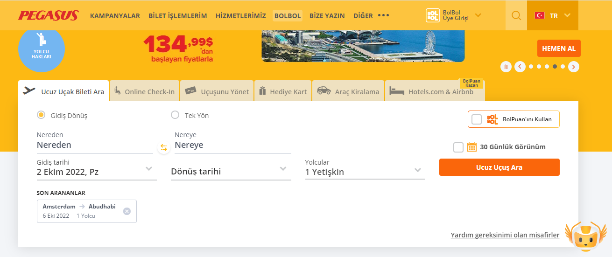

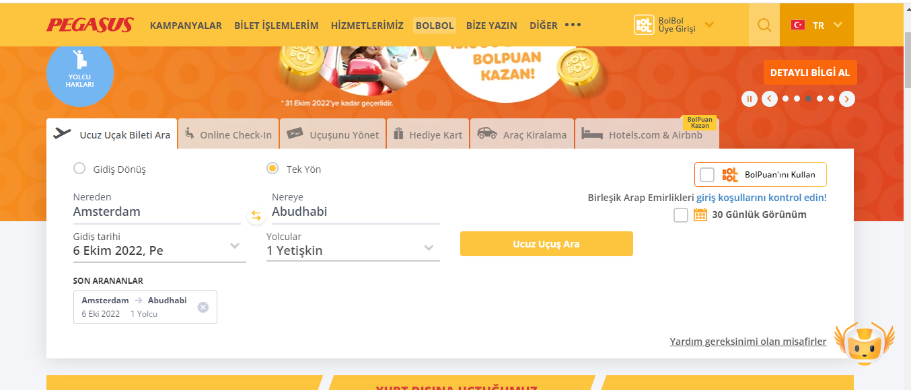

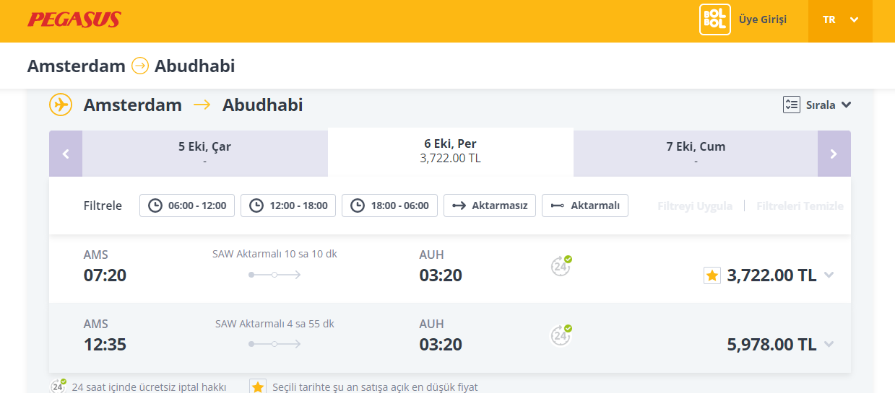

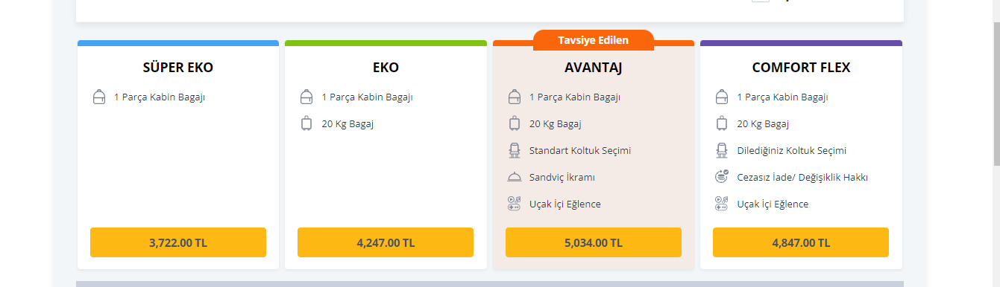

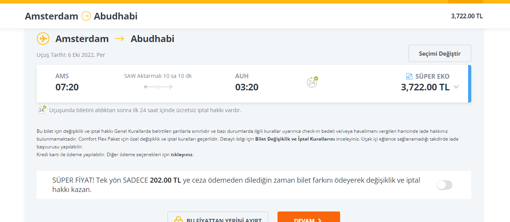

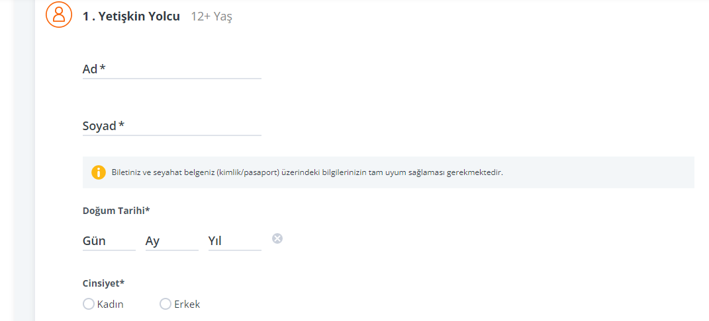

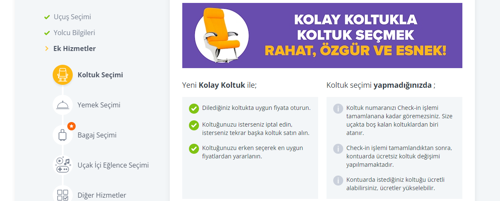

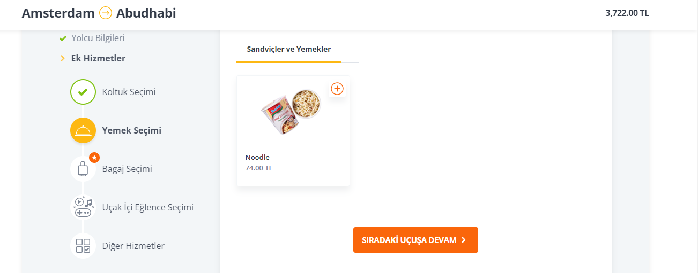

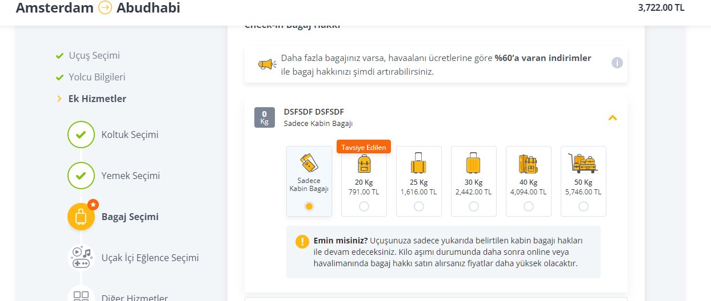

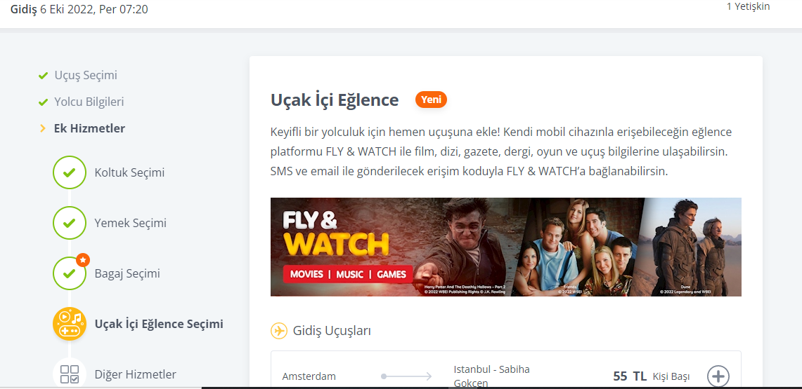

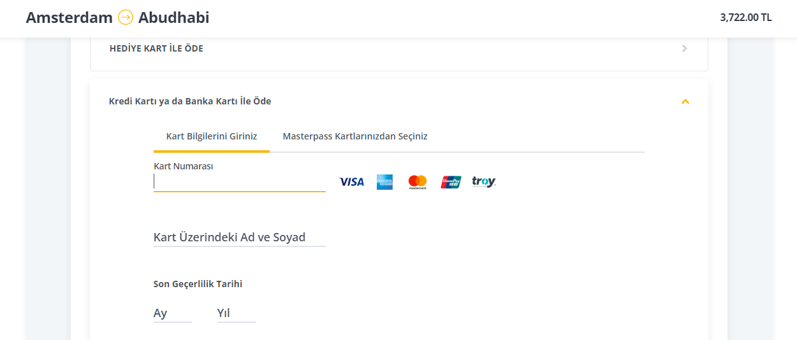