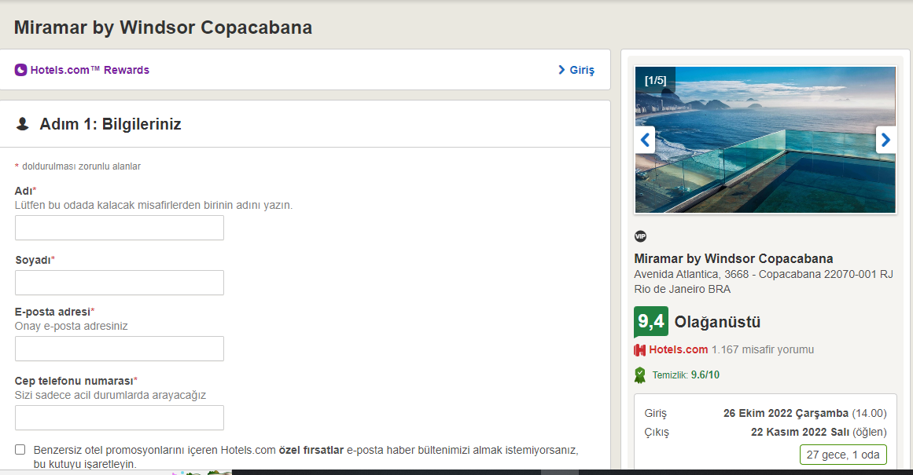

Hotels Selenium test otomasyon projesidir. Hotels Dünya genelinde Hotel odası arama, seçme,rezervasyon yapma,satın alma,favorilere ekleme, ekleyip çıkarma işlemleridir.

- https://tr.hotels.com/ sitesine gelecek ve anasayfanin acildigini onaylayacak
- İlk olarak 'Nereye' butonuna tiklayacak ve varis noktasını belirleyecek,
- Takvim Butonuna tiklanacak ve Seyatahat edilecek tarih girilicek,
- Sonrasinda 'Misafir Sayısı' butonuna tiklatilacak ve misafir sayısı girilecek,
- Ardindan 'Ara' butonuna tiklatilicak,
- Acilan sayfa da begendigimiz oda belirlendikten sonra üzerine gelip tiklanacak,
- Sonrasinda karsimiza acilan sayfa da 'Oda Rezervasyonu Yap' butonuna tiklanacak,
- Alt tarafta 'Odanızı seçin' alanından oda türlerinden herhangi biri seçilerek 'Rezervasyon Yap' butonuna tiklanacak,
- Acilan kücük ekranda 'Konaklama Yerinde Öde' butonuna tiklanacak,
- Acilan yeni sayfa da 'Bilgileriniz' alanina kisisel bilgiler girilecek,
- Devam ettikten sonra alt tarafta 'Rezervasyon ve Kart Bilgileri' alanını girilecek,
- En son Adimda islemin basarili yada basarisiz olduğu kontrol edilecek

Hangi Teknolojiler Kullanıldı

- Bu proje için java ve intellij kullanıldı.
- Selenium Test Aracı olarak kullanıldı.

